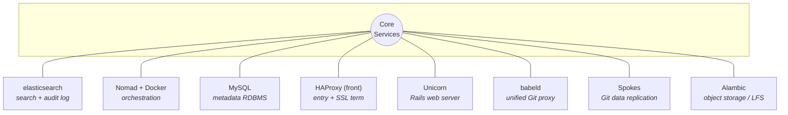
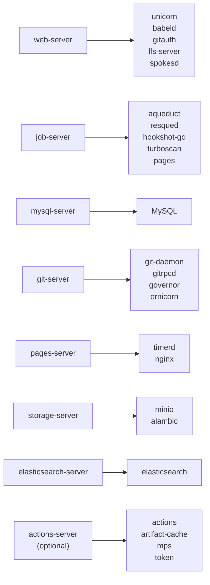
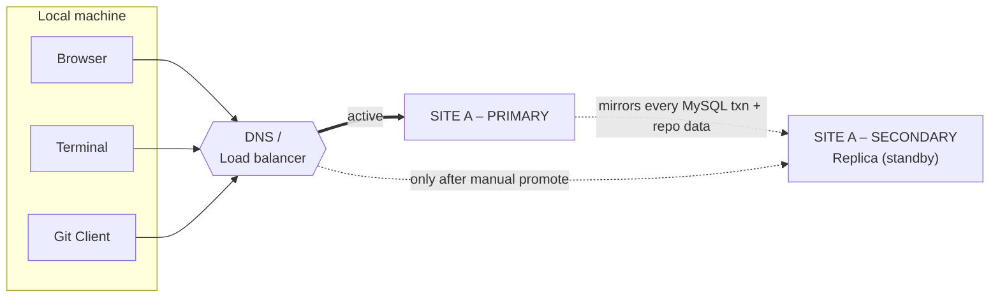
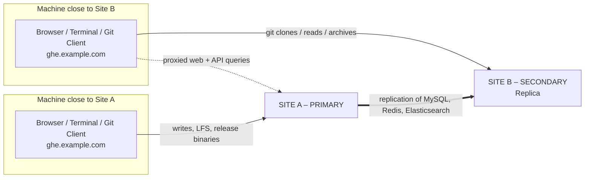
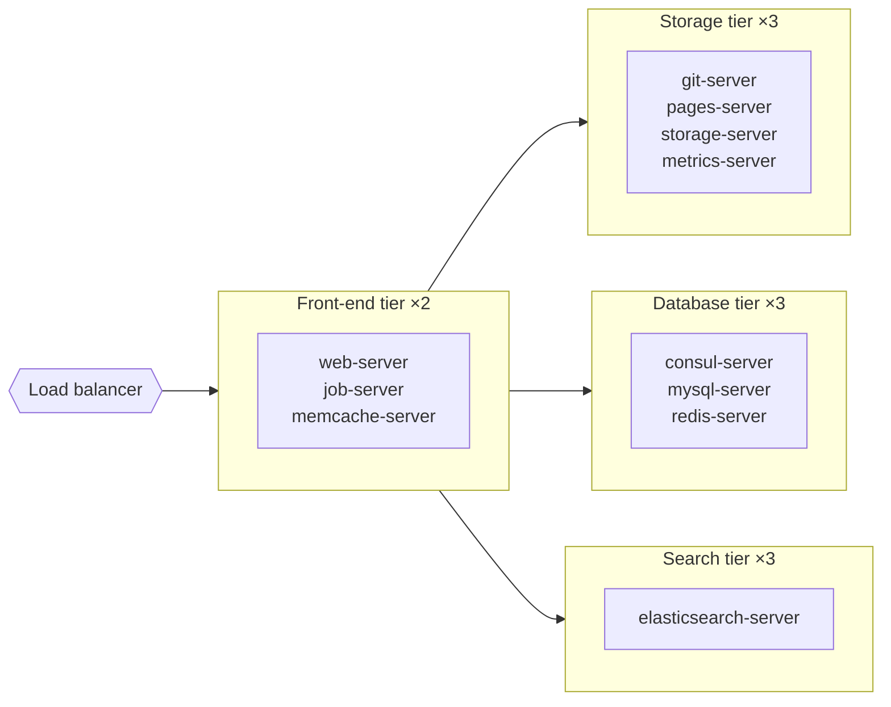

# GHES Deep Dive

## What it is

**GitHub Enterprise Server (GHES) is GitHub's self-hosted deployment.** Customers run it in their own datacenter or private cloud and own the upgrade, infrastructure, backup, and operational model.

**GHES is for control-first environments.** It fits customers that cannot use standard SaaS, or that need tighter infrastructure, networking, and change-management control than GHEC provides.

## Key differentiators vs GHEC

| Topic | **GHES** | **GHEC** |
| --- | --- | --- |
| Hosting | Customer-managed | GitHub-managed |
| Upgrades | Customer plans and executes them | GitHub handles them |
| Feature velocity | Slower, version-based | Fastest |
| Identity model | Local plus external identity integrations | Native cloud enterprise hierarchy and EMUs |
| Networking | Customer-controlled, can sit in isolated networks | SaaS, with enterprise networking controls for supported features |
| Best fit | Regulated, isolated, custom-hosted | Most mainstream enterprises |

## When customers choose GHES

- **Strict regulatory or sovereignty needs** that rule out standard SaaS
- **Air-gapped or tightly controlled networks**
- **Customer-owned infra strategy** where core developer systems must stay private
- **Change-management requirements** that demand customer-controlled upgrade windows
- **Hybrid estates** where some services stay on-prem while others move to cloud later

## Version lifecycle

**GHES is a release-managed appliance, not an always-current SaaS.** Customers need an upgrade program.

### Current public release snapshot

| Item | Status |
| --- | --- |
| **Latest stable docs version** | **GHES 3.21** |
| **Public support policy** | **GitHub supports at least the four most recent feature releases** |
| **Supported releases as of 2026-06-23** | **3.21, 3.20, 3.19, 3.18** |
| **Recently still supported** | **3.17**, closing down **2026-08-25** |

**Practical takeaway:** plan around a steady upgrade cadence. Do not let customers treat GHES like an appliance they can ignore for years.

> [!note]
> **Always verify the exact closing-down date for the customer's target version.** GHES support is version-specific, and feature availability can differ materially by release.

## Deployment model

**GHES is deployed as a virtual appliance.** Customers typically run it on major virtualization or cloud IaaS platforms rather than on bare metal.

Common patterns include:

- **VMware-based private clouds**
- **OpenStack KVM / KVM-based environments**
- **Public cloud IaaS**, such as AWS, Azure, or GCP, when self-hosting is still preferred
- **Other approved hypervisor patterns**, depending on the current support matrix

**Sizing is customer-specific.** Hardware requirements depend on users, repos, Actions usage, Packages, and expected growth.

## Administration model

### Main admin surfaces

| Surface | What it is used for |
| --- | --- |
| **Management Console** | Web UI for appliance-level configuration and status |
| **Administrative shell (SSH)** | Direct admin access for operational tasks |
| **`ghe-config` / `ghe-config-apply`** | Appliance configuration changes from the CLI |
| **Backup utilities** | Backup and restore workflows, commonly `ghe-backup` and `ghe-restore` |
| **Release packages and hotpatches** | Version maintenance and patching |

**CRE framing:** GHES admins need both platform and GitHub product skill. This is not just a repo collaboration tool, it is an application platform the customer operates.

## High availability and clustering

### High availability

**GHES high availability is active/passive replication.** A fully redundant replica is kept in sync with the primary through asynchronous replication of major datastores.

Key facts:

- The replica runs in standby mode
- It helps with infrastructure failure scenarios
- It is **not** a backup strategy
- It is **not** a zero-downtime upgrade strategy

### Clustering

**Clustering is for larger scale-out topologies.** Customers can run multi-node cluster deployments, then add high availability replication for the whole cluster.

Useful details for customer conversations:

- HA for clusters requires replica nodes that mirror the active cluster layout
- Public docs recommend **less than 70 ms latency** between primary and replica nodes in clustered HA
- Public docs note a maximum of **8 high availability replicas** across passive, geo, and cache replica types

## GitHub Connect

**GitHub Connect is GHES's bridge to GitHub Enterprise Cloud.** It gives selected cloud-backed capabilities without moving the primary code hosting surface to SaaS.

| GitHub Connect capability | Why customers care |
| --- | --- |
| **License sync** | Avoid double-counting users across GHES and cloud |
| **Dependabot-backed vulnerability data** | Brings cloud advisory intelligence into GHES workflows |
| **Unified search** | Lets users see search results across connected environments |
| **Unified contributions** | Reflects GHES contribution counts in cloud contribution views |
| **GitHub.com Actions access** | Allows approved use of actions from GitHub.com |

**Important constraint:** when connecting to **GHE.com**, public docs say **Server Statistics** and **GitHub.com Actions** are not available.

## Feature parity gaps vs GHEC

**GHES does not get cloud features first.** Expect lag, partial parity, or no parity for some capabilities.

Typical gaps or caveats:

- **Cloud-first feature velocity**, especially for Copilot and newer security workflows
- **Enterprise Managed Users**, which is a GHEC identity model
- **Data residency on GHE.com**, which is a cloud deployment option, not GHES
- **GitHub-hosted services** like fully cloud-native hosted compute experiences
- **Some Dependabot and advisory flows**, which may need GitHub Connect on GHES

**Best CRE answer:** do not promise parity by principle. Check the customer's exact GHES version.

## Upgrade process

**Upgrades are an operational project.** Customers should test, schedule downtime or maintenance windows as needed, and validate integrations before production rollout.

### Common upgrade paths

| Upgrade type | Typical use |
| --- | --- |
| **Hotpatch** | Upgrade to a newer **patch release within the same feature series** |
| **Feature release upgrade** | Move from one feature series to the next, for example 3.20 to 3.21 |

### Practical upgrade flow

1. **Check release notes, prerequisites, and support dates**
2. **Take backups and confirm recovery path**
3. **Test on staging if possible**
4. **Apply hotpatch or upgrade package**
5. **Run post-upgrade validation for auth, Actions, Packages, and integrations**

## Backup and recovery

**Backups are mandatory.** HA is not enough.

Key points:

- Backup utilities are the standard recovery path
- Customers can back up from certain replica nodes in HA or cluster topologies
- Backup, restore, and failover should be rehearsed, not just configured

## Common customer scenarios

| Scenario | Why GHES fits |
| --- | --- |
| **Air-gapped or isolated network** | SaaS access is restricted or impossible |
| **Strict regulated workload** | Customer wants full infra custody and change control |
| **Private cloud standardization** | Engineering platforms must run on customer-owned virtualization |
| **Hybrid transition** | Customer wants GHES now, cloud-connected capabilities later |
| **Custom operational governance** | Upgrade timing and infrastructure controls stay in-house |

> [!tip]
> **CRE tips**
> - Ask for the **exact GHES version** early. Many answers change by version.
> - Separate **HA**, **backup**, and **disaster recovery**. Customers often conflate them.
> - Ask whether the customer wants **self-hosting forever** or **self-hosting for now**. That changes the migration conversation.
> - If a customer asks for a cloud feature on GHES, answer with **version, dependency, and parity caveat**, not a yes or no guess.

---

## Services architecture (under the hood)

Source: internal training "GitHub Enterprise Server Services Breakdown" (Loom).
Run `ghe-service-list` on an instance to see the live service list. 
Note: this session reflects an older GHES generation (Debian Jessie/Stretch, GHES 2.x era terms), so verify against the current version before relying on specifics.

> [!important] Key points to remember
> - **Everything enters through the external HAProxy, which is also where SSL terminates.** There are two HAProxy instances: external and internal. Seeing `localhost` in logs is normal because requests are proxied between internal processes.
> - **MySQL is why upgrades and failovers need downtime.** It does not support live rolling migrations or instant primary switchover. GitHub.com avoids this with Orchestrator (instant failover) and gh-ost (online schema migrations), but those are not on GHES yet.
> - **`babeld` is the single entry point for all Git connections** (HTTP, SSH, raw git protocol, SVN). Auth happens in `git-auth` before any repo data is served; `git-daemon` sits at the bottom of the stack.
> - **The biggest real-world cause of tickets is artificial load** (CI systems, API polling) that the per-seat sizing guidance does not account for. Fix is scale the instance or fix the noisy process.
> - **Worker tuning has almost no downside except cost.** Add Unicorn/Resque/Hookshot workers if there is spare CPU and memory. There is no hard max beyond what the instance can resource.
> - **HA replication uses OpenVPN between primary and replica.** The `/credits` page on any instance lists all open source software, versions, and licenses.
> - Reference artifacts (slide deck, service repo links, architecture PDF, recording) live in the internal GitHub Services repo issue (referenced in the session as #3656).

### Base platform

- **OS**: Debian (Jessie 8, moving to Stretch 9 around GHES 2.17).
- **Open source components**: OpenSSL/BoringSSL, OpenSSH, OpenVPN, HAProxy, nginx, Elasticsearch, Consul, Redis, MySQL, Memcached. Full list with versions and licenses at `https://<instance>/credits`.
- **Unicorn**: Ruby web server for Rack apps. Workers auto-die and restart on timeouts, errors, or exceptions, so one bad request does not take down the app. You set a worker count instead of managing threads/processes. The "angry unicorn" page means your request's worker died mid-request and you should retry.

### Core services

| Service | What it does | Notes / language |
| --- | --- | --- |
| **alambic** | Serves assets: avatars, Git LFS objects, release/issue attachments, uploaded GIFs | Data can move to a separate fast volume/tier but **not NFS**. Log: `/var/log/alambic` |
| **babeld** | Unified Git proxy, endpoint for all Git connections (HTTP, SSH, git protocol, SVN) | Written in C. Switched OpenSSL to BoringSSL for more throughput (cut PayPal from 6 instances). Log: `/var/log/babeld` |
| **codeload** | Generates and serves release tarballs via `git archive` | Caches ~1 hour then deletes to save space. C |
| **consul** | HashiCorp service discovery | Currently logging only; integration ongoing toward Kubernetes-based GHES |
| **elasticsearch** | Powers search and the audit log; each replica holds a full copy of the indices | Apache Lucene, Java. Some version jumps need a manual index migration script before upgrade |
| **enterprise-manage** | Runs the Management Console and everything under `/setup` (initial config, LDAP/SAML changes) | Sinatra app. Lives outside github/github in the enterprise2 repo |
| **ghe-user-disk** | Creates the `/data` volume on first build and triggers all other services to start | If the data volume is lost, nothing else starts |
| **git-auth** | Authenticates every request (SSH keys, PATs, passwords, deploy keys) before repo data is served, then runs the permission check | Works with babeld |
| **git-daemon** | Bottom of the Git stack; serves push data and port 9418 (anonymous/unauthenticated cloning) | Part of Git itself |
| **github-unicorn** | The main GitHub Rails app (github/github); API side via Sinatra | Now uses official Ruby/Rails releases. Scales with CPU/memory. ~8 logs under `/var/log/github` |
| **github-ernicorn** | Thrift RPC server (based on Ernie/Erlang) to run Git operations on remote nodes in clusters/replicas without SSH | Log: `/var/log/github-ernicorn` |
| **git-governor** (was gitmon) | Analytics and quotas for Git: rate limiting, records clones/pulls/pushes | Retains up to 2 weeks or 1 GB. Query with `ghg-governor`. Great for performance investigations |
| **gpgverify** | Commit signature verification (the "Verified" badge) | Written in Go. Usually all-or-nothing: it works or it is down |
| **grafana / graphite / collectd** | Metrics monitoring behind `/setup/monitor` | collectd collects, graphite stores/translates, grafana displays. Only collectd can forward metrics externally |
| **haproxy** | Proxies connections to internal services; **SSL termination point** (certs live here) | Two instances: external and internal |
| **hookshot** | Webhook delivery; runs its own unicorns and job queue | Sinatra. Logs moved from Elasticsearch to MySQL as of GHES 2.16 for longer retention |
| **longpoll** | Live page updates (e.g. issue comments without refresh) | Replaced on GitHub.com because it did not scale to many/long-lived connections |
| **mysql** | Core RDBMS storing all metadata: users, orgs, teams, issues, PRs, comments | See key points: main reason upgrades/failovers need downtime |
| **openvpn** | Secure node-to-node connection | Used **only** for replication (replica to primary) |
| **resqued** | Redis-backed background job queue (~30-40 queues, tunable workers and priorities) | Log: `/var/log/resqued` |
| **render** | Renders file types like PSDs instead of showing raw code/diff | Kicks off a background job on request |
| **slumlord** | Rack server that terminates SVN client requests into Git backends | Started as an April Fools joke, kept because it worked |

### Request flow

External request to **external HAProxy** to the process responsible for it. That process may call the **internal HAProxy** to reach downstream services (e.g. git-auth, babeld, git-daemon). Tracing a broken request means following it across these processes, which is why logs show `localhost` hops.

### Operational takeaways for support

- **Sizing** is guidance per seat (e.g. ~4 CPU / 32 GB per 1000 seats), but does not model CI/API polling load. Most performance tickets trace back to that unaccounted artificial load.
- **Scaling workers**: auto-scaling by instance size is minimal. If there is free CPU/memory, add workers (Unicorn, Hookshot, Resque). No downside except infrastructure cost.
- **The `D` suffix** on service names (resqued, collectd, longpoll-d) just means daemon, the Linux convention for background services.

---

## Cluster architecture (training session)

Source: internal training "GHES Cluster Training – Session I" (Loom). Diagrams below are reproduced from the session slides.
Note: this session reflects a **modern, containerized GHES** (3.14.x era, Nomad + Docker). It supersedes the older "Services architecture (under the hood)" section above, which describes the pre-container GHES 2.x generation. Reconcile against the customer's exact version.

> [!important] Key points to remember
> - **Most services now run as Docker containers orchestrated by Nomad.** Never drive Docker directly — use `nomad status` to inspect and Nomad to bounce a service; it manages the Docker backend. A container's UUID first segment matches its Nomad allocation ID.
> - **Learn GHES as a cluster first.** A standalone instance is just *all roles and services running on one node*; a cluster spreads those same roles across nodes.
> - **In a true cluster the only single point of failure is the MySQL primary** (it is also the **Nomad leader**, and many admin commands must run there). Web/job nodes are **stateless**; storage survives losing 1 of 3 replicas.
> - **You assign roles, not individual services.** Roles group services onto nodes via `cluster.conf`.
> - **Geo/active replicas are NOT horizontal scaling.** They only accelerate **Git-read** ops; web/API requests proxy back to the primary. Correct customers who plan to "load-balance users across geo replicas."
> - **`ghe-config-apply` and `ghe-cluster-config-apply` resolve to the same thing.** The cluster wrapper just checks the `ha`/cluster settings. Don't run a full config-apply for a minor change (can be ~40 min on a large cluster) — restart the specific Nomad service instead.
> - **`ha = true` in `cluster.conf` means an HA replica pair, not a true cluster.** A true cluster omits that flag and lists per-node roles.
> - **Git data (and alambic/pages) is replicated 3×**, which is why a true cluster needs a minimum of 3 storage/data nodes. Spokes uses a 3-way handshake to commit a push across all three replicas.

### Core services (the foundation wheel)

These are the services no GHES install runs without. Everything except Elasticsearch below is a community/OSS component GitHub packaged; babeld, spokes and alambic are GitHub-built.

**Request paths:**
- **Web/API** → HAProxy (front) → **Unicorn** (Ruby on Rails). Backend down → HAProxy returns `503`.
- **Git** (HTTP/SSH/git proto) → HAProxy (front) → **babeld** → gitrpcd → **spokes** (looks up and serves the replicated data).
- There are **three HAProxy flavors** (front / cluster-proxy / internal). A front-end node uses **agproxy cluster-proxy** to forward a request to a service hosted on another node.

### Roles (grouping services onto nodes)

There are ~90+ services; you never hand-place them. Instead you assign these **8 roles** to nodes in `cluster.conf`, and Nomad/Consul spin up the role's services on that node.

| Role | Key services | Notes |
| --- | --- | --- |
| **web-server** | unicorn, babeld, gitauth, lfs-server, spokesd | Front-end / stateless |
| **job-server** | aqueduct, resqued, hookshot-go, turboscan, pages | Background jobs |
| **mysql-server** | MySQL | One node is the **primary** (SPOF + Nomad leader) |
| **git-server** | git-daemon, gitrpcd, governor, ernicorn | Git backend |
| **pages-server** | timerd, nginx | GitHub Pages |
| **storage-server** | minio, alambic | Object storage / LFS |
| **elasticsearch-server** | elasticsearch | Search + audit |
| **actions-server** *(optional)* | actions, artifact-cache, mps, token | Only if Actions is enabled |

### Deployment & replication options

**HA (passive)** — a passive replica mirrors the primary and does nothing until a **manual failover** flips DNS/load-balancer to it.

**Geo (active)** — an active replica placed near a second dev site serves **Git reads/clones/archives locally**, but Git **writes** and **web/API** requests are proxied back to the primary. This is **not** horizontal scaling.

**True cluster (reference architecture)** — a load balancer fronts a **web tier ×2** and three backend tiers **×3** each; every tier scales independently.

- **Reference architecture:** 3 of each backend tier (storage/database/search) + 2 front-end nodes for redundancy. Each tier scales **independently** (e.g. IBM ran ~16 storage nodes; add web nodes as user load grows). The lab uses a trimmed 5-node layout (2 app + 3 data).
- **Why customers cluster:** horizontal scaling once a single appliance can't grow further (the SAP scenario). Not for the average customer.
- **A/B partition upgrades:** each VM has an **OS disk** (root, `A`/`B` partitions) and a **data disk** (`/data/user`). An upgrade re-images the *inactive* partition, swaps the bootloader, and reboots — user data on the data disk is untouched.

### Configuring a cluster (`cluster.conf`)

- One file at `/data/user/common/cluster.conf` drives **HA, geo, and true cluster** — the difference is the entries and the `ha` flag.
- **`ha = true`** under the `[cluster]` block ⇒ HA replica pair. Omit it ⇒ true cluster with explicit per-node role assignments.
- Rollout on the **MySQL primary node**: create `cluster.conf` → `ghe-cluster-config-init` (reachability + SSH key exchange across nodes) → `ghe-config-apply` (each node runs its own config-apply).
- `ghe-config-apply` renders Nomad HCL templates per service, then starts them; the final phase **validates services** and names any that failed. Unicorn and Git services take longest to come up. Config-apply log: `/data/user/common/ghe-config.log`.

### Repositories & code-version tips (for troubleshooting)

| Repo | Purpose |
| --- | --- |
| **github/github** | Shared codebase with .com. Match a customer's version via the release **tag** (e.g. browse `3.14.7`) before trusting a line number in a stack trace. |
| **github/enterprise2** | GHES-specific wrapper scripts (e.g. `ghe-config-apply`). |
| **github/ghes** | Engineering issues, feature tracking, and support escalations. |

- **MySQL scale:** ~1,200 tables ship with GHES; nearly every UI action is many DB ops. Port errors (3306/3307) → `nomad status mysql`.
- **Upgrade migrations:** schema changes live in `github/github` under `db/migrate`. On huge databases a post-upgrade migration/backfill can run **10–20+ hours** — set customer expectations.
- **Useful commands seen in the session:** `nomad status`, `nomad status <service>`, `ghe-spokes` (which nodes hold a repo), `ghe-repo <owner>/<repo>` (jump to on-disk path), `ghe-cluster-config-init`, `ghe-config-apply`.
