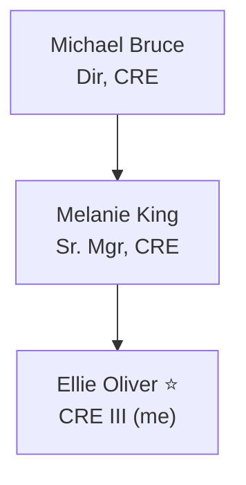

# CRE Team & Org

My team and reporting chain at GitHub, sourced from the Hubbers directory. Handy for escalations, finding the right person, and knowing who does what.

**Last updated:** 2026-07-02 (via HubbersMCP)

---

## Me

**Ellie Oliver** (`elroseo`) - Customer Reliability Engineer III - Remote-CAN-ON (Canada)
Manager: [[Melanie King]]

---

## Reporting chain

| Level           | Person        | Login           | Title           |
| --------------- | ------------- | --------------- | --------------- |
| Manager         | Melanie King  | `melanie-king`  | Sr. Mgr, CRE    |
| Skip (Director) | Michael Bruce | `michael-bruce` | Dir, CRE        |

---

## My team

| Person | Login | Title | Location |
|---|---|---|---|
| **Ellie Oliver** ⭐ (me) | `elroseo` | CRE III | Remote-CAN-ON |
| Carlos Naranjo | `carlosjnaranjo` | Senior CRE | Remote-USA-CO |
| Peter Kovacs | `eptekov` | Senior CRE | Remote-USA-TX |
| Jessica Widener | `jesscetera` | Senior CRE | Remote-USA-UT |
| Kurtis Foley | `kfo3` | CRE III | Remote-USA-TX |
| Max Power | `maxwellpower` | CRE III | Remote-CAN-AB |
| Munish Suri | `munishsuri` | CRE III | Remote-CAN-ON |
| Pooja Reddypalle | `preddypalle97` | CRE III | Remote-CAN-ON |
| Mike Lowry | `scarletspiderfan` | CRE III | Remote-USA-SC |
| Tanya Sheoran | `tanyasheoran` | CRE III | Remote-USA-CA-Metro |

> Senior CREs (Carlos, Peter, Jessica) are good go-to's for deeper technical questions.

---

## Peer managers (Michael Bruce's other directs)

`brandonaus` · `dannyleblanc` · `mwiesen` · `swedabl` — sibling CRE teams under Michael Bruce. Useful when routing an escalation to another pod.

---

## Notes

- People I have dedicated profiles for: [[Melanie King]].
- To refresh this from the directory: ask Copilot to "rebuild my CRE team note from HubbersMCP."
- Consider adding profiles for teammates I pair with often (e.g. Munish Suri, Kurtis Foley).

## Related

- [[People/README|People folder]]
- [[Voice/Goals|Goals]] (CRE pillars: Mentorship, Collaboration)
